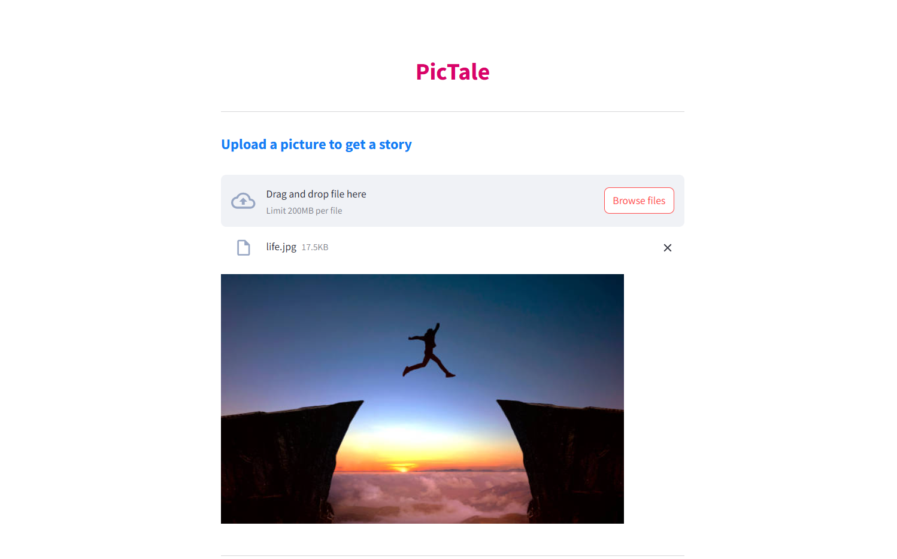

# Huggingface-PicTale

### **Description**

This project allows users to upload an image, and then it generates a story based on that image.

### **How it works**

The user uploads an image. This image is passed as input to an image-captioning model, which creates a caption for the uploaded 
image. Then, the resulting caption is used as input to another model, which generates a story based on the caption. Finally, the 
generated story is displayed to the user.

### **Requirements**

- **Python 3.7+**
- **Streamlit**
- **Requests**
- **huggingface-hub**

You can install the necessary dependencies using `pip` by running:

```bash
pip install streamlit requests huggingface-hub
```

### **How to Run**

1. **Clone the Repository**:
   Clone this repository to your local machine:
   ```bash
   git clone https://github.com/your-username/your-repo-name.git
   cd your-repo-name
   ```

2. **Run the Streamlit app**:
   ```bash
   streamlit run streamlit_app.py
   ```
3. **Upload an image**: Once the app is running, you can upload an image, and the caption and story will be displayed.


### **Models Used**

- **BLIP Image Captioning Model**: A model trained for image captioning tasks.
  - Model link: [BLIP on Hugging Face](https://huggingface.co/Salesforce/blip-image-captioning-large)

- **Zephyr Model**: A large language model trained for generating creative text based on user input.
  - Model link: [Zephyr on Hugging Face](https://huggingface.co/HuggingFaceH4/zephyr-7b-beta)


### **Example**

Here is an example of how the app works:




